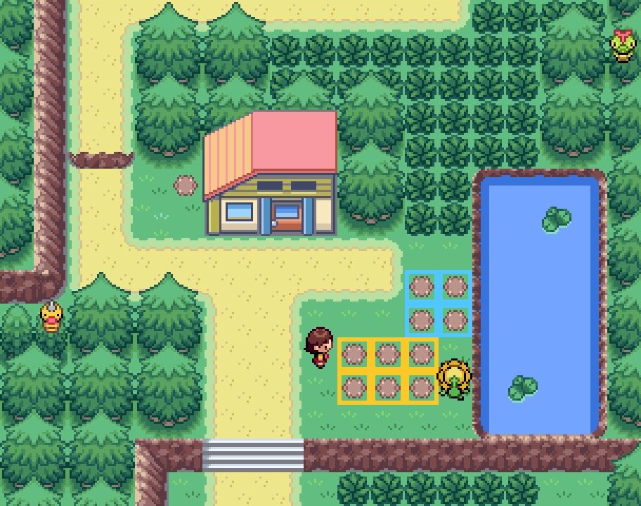
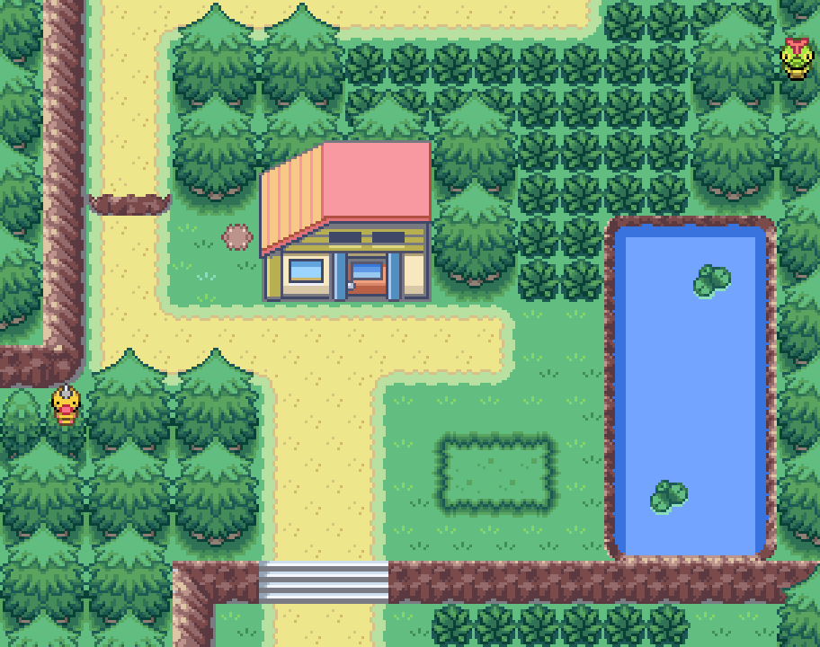
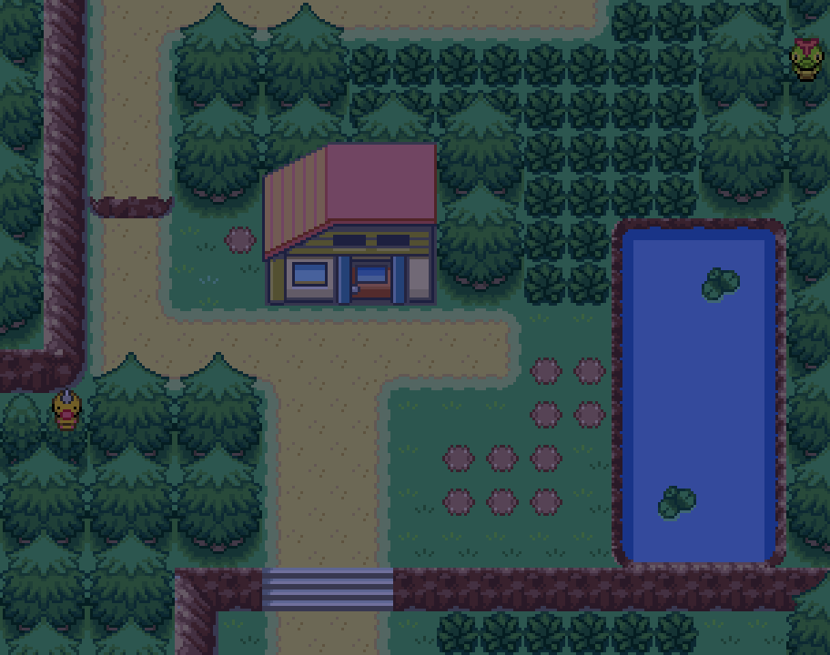

# Berry Master e esposa — a Horta da Route 30

> **Proposta rev1 — 29/09/2026.** Nada disto está implementado. O que existe hoje
> é o que o `.claude/KURT_BALL_CRAFT_DESIGN.md` §5 fez (e que está no ar):
> ele dá 2 berries comuns por dia, ela dá 1 rara por dia depois da Liga.
> Este documento transforma os dois num **sistema**: uma horta de verdade ao
> lado da casa, pedidos diários, um grau de horticultor que destrava coisas,
> cruzamento de berries como “ciência” da esposa e uma horta que tem vida
> (pragas, ervas daninhas). Tudo em cima de mecânicas que **o motor já tem e
> estão desligadas**.
>
> Texto do documento em português; **texto que aparece no jogo, em inglês**.

| Rev | Data | O que mudou |
|---|---|---|
| 1 | 29/09 | Primeira proposta: auditoria do motor, horta, pedidos, graus, cruzamentos, pragas, feira de domingo, custos |

---

## 0. Em uma tela

```
            ┌──────────── todo dia ────────────┐
            │                                  │
   Berry Master  ──2 berries──▶  jogador ──planta──▶  HORTA (10 canteiros)
   (pedido do dia: "5 Persim")        ▲               │  cresce, dá praga,
            ▲                         │               │  dá erva daninha,
            │                         └──colhe────────┘  CRUZA com o vizinho
            │                                                 │
            └──── entrega o pedido ──▶ Pontos de Horta ──▶ GRAU 1…5
                                                          │
         Esposa: "Kelpsy? Chesto do lado de Persim."  ◀───┘ destrava canteiros,
         (caderno de cruzamentos, Surprise Mulch)            dica, adubo, feira
```

| Peça | O que é | Custo novo |
|---|---|---|
| **Horta** | 6 canteiros no canteiro que o mapa **já tem desenhado** ao lado da casa + 4 que abrem no grau 2 | 10 objetos, 10 IDs de árvore reciclados, 0 flag |
| **Pedido do dia** | Ele pede N de uma berry; entregar dá Pontos de Horta e um prêmio | 2 daily flags, 1 var |
| **Grau de horticultor** | 5 graus por pontos; cada grau destrava algo concreto | 1 var |
| **Caderno de cruzamentos** | Liga `OW_BERRY_MUTATIONS`. A esposa é quem ensina as 13 receitas que o motor já tem | 1 config + textos |
| **Horta viva** | Pragas (batalha com inseto) e ervas daninhas **só nos canteiros** | ~15 linhas de C |
| **Feira de domingo** | Domingo o pedido paga dobrado e ela vende os adubos que não têm fonte | 1 pokemart |
| **Colheita do dia** | Ele comenta quantas berries você colheu hoje e dá uma a mais se foram muitas | 0 — a var já existe |

**Nenhuma flag persistente nova.** Tudo que é progresso fica numa var; o que é
“uma vez por dia” fica em daily flags livres; o que esconde canteiro trancado é
`FLAG_TEMP`.

---

## 1. O que já existe (auditoria do motor e do mapa)

Coisas que o plano usa e **já estão no repositório**. Cada linha foi medida.

| Fato | Onde | Por que importa |
|---|---|---|
| O mapeador **já desenhou um canteiro vazio**, com borda de sebe, 3×2, ao lado da casa | `Route30` (28..30, 43..44), metatiles 189–191 / 205–207 | É o lugar óbvio da horta: ninguém precisa redesenhar nada (§2) |
| O solo de berry é o metatile **46 com colisão** | 13 das 22 árvores de Johto medidas estão em cima dele | É só trocar o metatile |
| **128 vagas** de árvore no save; **36** usadas por mapas na ROM | `include/constants/berry.h:189`, `global.h:1177` | Sobra muito |
| **83 IDs recicláveis**: só aparecem em mapas de Hoenn (fora da ROM) **e** não têm berry natural | cruzamento de `map_groups.json` × `sNaturalBerriesByTreeId` | Os 10 canteiros cabem sem aumentar o save |
| `OW_BERRY_MUTATIONS`, `OW_BERRY_WEEDS`, `OW_BERRY_PESTS`, `OW_BERRY_MOISTURE`: **todos FALSE** | `include/config/overworld.h:36-42` | O sistema inteiro está pronto e desligado |
| Tabela de **13 cruzamentos** pronta | `src/berry.c:2455` `sBerryMutations` | É a árvore tecnológica da esposa (§5) |
| O cruzamento é guardado em **4 bits** (`mutationA:2` + `mutationB:2`) → valores 1..15 | `src/berry.c` `union TreeMutation` | Cabem **mais 2** receitas, não mais que isso |
| Cruzamento só acontece **ao plantar**, com vizinho **ortogonal** que já tem planta, 25% (×2 com Surprise/Amaze Mulch) | `TryForMutation`, `src/berry.c:2485` | Canteiros precisam ser contíguos; árvore natural (pré-gerada) **nunca** cruza |
| Pragas por cor da berry: Ledyba, Volbeat, Illumise, Burmy, Combee, Spewpa, **nível 14–16 fixo** | `GetBerryPestSpecies`, `src/berry.c:2568` e `:2397` | Precisa virar Johto e escalar com o jogo (§6) |
| 4 adubos vendidos na floricultura de Goldenrod (Growth, Damp, Stable, Gooey) | `GoldenrodCity_FlowerShop/scripts.inc:771` | Os outros 4 (**Rich, Surprise, Boost, Amaze**) **não têm fonte** — viram prêmio (§3, §7) |
| `OW_BERRY_MULCH_USAGE` = TRUE | `overworld.h:40` | Adubo já funciona |
| `VAR_DAILY_PICKED_BERRIES` e `VAR_DAILY_PLANTED_BERRIES`: o motor soma, e **zeram todo dia** | `src/tv.c:2508-2516` soma, `tv.c:2462` zera | “Quantas você colheu hoje” de graça (§8) |
| `special GetDayOfWeek` funciona em script | `data/specials.inc:300`, usado em Cherrygrove e Cianwood | Feira de domingo (§7) |
| Árvores de rota **renascem sozinhas** em 12 h | `NATURAL_BERRY_TREE_REGEN_MINUTES`, `EventScript_ResetAllBerries` | Ver nota abaixo |

> **Nota de passagem.** O `KURT_BALL_CRAFT_DESIGN.md` §1.6 diz que “árvores de berry
> começam vazias”. Não é mais verdade: `new_game.inc:166` chama
> `EventScript_ResetAllBerries`, e as árvores de rota são naturais e renascem.
> O que continua verdade é que **plantar** é o único jeito de ter uma berry que a
> rota não dá. A horta é exatamente isso.

---

## 2. A horta



*Amarelo: canteiro A (abre no tutorial). Azul: canteiro B (abre no grau 2). A
esposa aparece de dia na coluna x=27. Render feito dos arquivos do repositório com
`mapa_kit.py`, com o solo 46 carimbado por cima.*

| Hoje | À noite, com a proposta |
|---|---|
|  |  |

### 2.1 Os canteiros

Coordenadas em `Route30` (y cresce **para baixo**). A casa ocupa x=24..27,
y=36..39, porta em (26,39); o lago começa em x=32.

| Canteiro | Células | Abre em | Metatile hoje → proposta |
|---|---|---|---|
| **A** | (28,43) (29,43) (30,43) / (28,44) (29,44) (30,44) | tutorial (grau 1) | 189–191, 205–207 → **46 + colisão** |
| **B** | (30,41) (31,41) / (30,42) (31,42) | grau 2 | 0/1 (grama) → **46 + colisão** |

**Todo canteiro é alcançável** (solo tem colisão, então medi de onde se fala com
cada um):

| Canteiro | Fala de |
|---|---|
| (28,43) | (28,42) ou (27,43) |
| (29,43) | (29,42) |
| (30,43) | (31,43) — (30,42) vira solo no grau 2 |
| (28,44) (29,44) (30,44) | linha y=45 |
| (30,41) (31,41) | linha y=40 (a trilha da porta) |
| (30,42) | (29,42) |
| (31,42) | (31,43) |

**Pares vizinhos para cruzamento:** A tem 7, B tem 4, e (30,42)–(30,43) liga os
dois. **12 pares** no total — é isso que faz a horta ser o lugar de cruzar.

### 2.2 IDs de árvore

Dez `#define` novos em `include/constants/berry.h`, **como apelidos** de IDs que só
Hoenn usa (fora da ROM) e que não têm berry natural. Apelido, e não renomear, para
não quebrar o `map.json` de Hoenn que ainda cita o nome velho:

```c
// Route 30 Berry Master's garden (.claude/berry_master/BERRY_MASTER_DESIGN.md).
// ALIASES of Hoenn-only slots: those maps are outside the ROM and these slots have
// no natural Berry in sNaturalBerriesByTreeId, so they are always player soil.
#define BERRY_TREE_GARDEN_A1  BERRY_TREE_ROUTE_103_CHERI_1   // 5
...
#define BERRY_TREE_GARDEN_B4  BERRY_TREE_ROUTE_123_QUALOT_1  // 14
#define BERRY_TREE_GARDEN_FIRST  BERRY_TREE_GARDEN_A1
#define BERRY_TREE_GARDEN_LAST   BERRY_TREE_GARDEN_B4
```

> **Não usar** IDs “com nome de berry” que estão em `sNaturalBerriesByTreeId` ou em
> `EventScript_ResetAllBerries` (ex.: `BERRY_TREE_STARF_1`, `BERRY_TREE_LUM_2`):
> eles nascem com berry natural e **renascem sozinhos**, o que apagaria o que o
> jogador plantou. A faixa 5..14 (Routes 103/104) é limpa e contígua — e contígua
> importa, porque §6 testa “é da horta?” com `>= FIRST && <= LAST`.

### 2.3 Canteiro B trancado

Sem flag persistente. No `ON_LOAD` da `Route30`:

- grau < 2 → `setmetatile` das 4 células de volta para grama sem colisão, e
- no `ON_TRANSITION`, `setflag FLAG_TEMP_x` que é a flag de ocultação dos 4 objetos
  de árvore do B.

As duas coisas são necessárias: uma árvore em estágio vazio já é invisível, mas
**continua interativa** — sem esconder o objeto, a grama pergunta “quer plantar?”.
Padrão e armadilhas na skill `visibilidade-e-gatilhos`.

### 2.4 Orçamento de objetos (o risco real do mapa)

`OBJECT_EVENTS_COUNT` = **16**, com jogador e follower dentro. Em volta da horta, na
pior posição (jogador em (27,40)), entram na área de spawn: 10 canteiros + a árvore
Oran de (23,38) + o Weedle de (19,42) + a esposa = **13**, +2 = **15 de 16**.

- **Por isso o Pokémon da esposa fica dentro de casa**, não na horta (ele levaria a 16
  e qualquer NPC a mais faria um canteiro **não aparecer**, sem erro nenhum).
- Se algum dia faltar vaga: tirar o Weedle decorativo de (19,42).
- `Route30` passa de 24 para 35 templates de objeto (limite 64).

---

## 3. O pedido do dia

A primeira conversa do dia sorteia um pedido; ele fica valendo até a virada do dia.

> **Berry Master:** Kurt's been in again. He wants five Persim for a batch of Level
> Balls, and my Persim tree's had a bad week.
> Grow me five and I'll make it worth your while.

### 3.1 Quem encomenda (sabor, não mecânica)

O pedido tem um “cliente” no texto, e todos são lugares que o jogador conhece:
**Kurt** (Azalea), **a floricultura** (Goldenrod), **a Nurse** do Centro de Cherrygrove,
**a Moomoo Farm**, **o Day Care**. O cliente é escolhido pelo mesmo sorteio (resto
da divisão), só muda a primeira frase.

### 3.2 O sorteio por faixa (sem tabela)

O enum de berries é contíguo (`ITEM_CHERI_BERRY` 514 .. `ITEM_MARANGA_BERRY` 580),
então cada faixa é `random N` + `addvar` — o mesmo truque do §5 do Kurt.

| Faixa | Berries (ordem do enum) | Qtd. pedida | Libera no grau | Por que |
|---|---|---|---|---|
| 1 | Cheri .. Persim (8) | 3 | 1 | As do tutorial e de Violet |
| 2 | Lum .. Iapapa (7) + Razz .. Pinap (5) | 5 | 2 | Pede escala: planta mais de um pé |
| 3 | **Pomeg .. Tamato (6)** | 3 | 3 | **Só se consegue cruzando** (§5) |
| 4 | Chilan .. Roseli (18) | 5 | 4 | As de resistência de tipo, da floricultura |
| 5 | **Liechi .. Apicot (5)** | 1 | 5 | Segunda geração de cruzamento |

No grau G o sorteio escolhe **uma faixa entre 1 e G** e depois uma berry dela
(dois `random`). Isso mantém pedidos fáceis aparecendo sempre.

### 3.3 Estado

| Coisa | Tipo | Onde |
|---|---|---|
| `VAR_BERRY_ORDER` | var: byte baixo = índice da berry (0..66), byte alto = quantidade | recicla `VAR_GIFT_UNUSED_6` |
| `FLAG_DAILY_BERRY_ORDER_ROLLED` | daily: “já sorteei hoje” | `FLAG_UNUSED_0x952` |
| `FLAG_DAILY_BERRY_ORDER_DONE` | daily: “já entregou hoje” | `FLAG_UNUSED_0x953` |

`ROLLED` segue o padrão do `FLAG_DAILY_KURT_NEW_DAY`: sem ele, cada conversa
sortearia um pedido novo e o jogador escolheria o mais fácil saindo e entrando.

### 3.4 Entrega — a ordem importa

```
checkitem <berry>, <qtd>           → não tem: diz o que falta e onde cresce; fim
yesno "Hand them over?"            → não: fim
checkitemspace <prêmio>, <qtd>     → sem espaço: avisa ANTES de tirar nada
removeitem <berry>, <qtd>
giveitem <prêmio>
setflag FLAG_DAILY_BERRY_ORDER_DONE
addvar VAR_BERRY_MASTER_POINTS, <pontos da faixa>
call BerryMaster_EventScript_CheckRankUp
```

O `checkitemspace` antes do `removeitem` é a lição do bug do Kurt
(`KURT_BALL_CRAFT_DESIGN.md` §1.3): tirar primeiro e descobrir a bolsa cheia depois
come os itens do jogador.

### 3.5 Prêmios

**Nunca Poké Ball** — o Kurt é a única fábrica (`KURT_BALL_CRAFT_DESIGN.md` §2.1).

| Faixa | Pontos | Prêmio |
|---|---|---|
| 1 | 1 | 1 Growth ou Damp Mulch |
| 2 | 2 | 2 berries sorteadas da faixa seguinte |
| 3 | 3 | **1 Surprise Mulch** (sem fonte hoje) |
| 4 | 3 | **1 Rich Mulch** (sem fonte hoje) + dinheiro |
| 5 | 5 | **1 Amaze Mulch** (sem fonte hoje) |

Domingo, tudo em dobro (§7).

---

## 4. Grau de horticultor

Uma var de pontos, `VAR_BERRY_MASTER_POINTS` (recicla `VAR_GIFT_UNUSED_5` — o
comentário diz “written, never read”, mas nenhum `.c`/`.inc`/`.pory`/`.s` do
repositório escreve nela; **conferir de novo antes de usar**). O grau é calculado
num lugar só, `BerryMaster_EventScript_ComputeRank`, como o
`KurtCraft_EventScript_ComputeLevel` — nada mais converte pontos em grau.

| Grau | Título (in-game) | Pontos | Destrava | Ritmo aproximado |
|---|---|---|---|---|
| 1 | Seedling | 0 | Tutorial, canteiro A, 2 berries/dia (o que já existe), pedidos faixa 1 | Route 30 |
| 2 | Sprout | 6 | **Canteiro B**, pedidos faixa 2, a esposa abre o caderno (§5) | ~1 semana |
| 3 | Grower | 18 | Presente diário vira **3 berries**, pedidos faixa 3 (cruzamento obrigatório) | ~2–3 semanas |
| 4 | Gardener | 36 | Pedidos faixa 4, **feira de domingo** com a esposa vendendo adubo raro (§7) | ~1 mês |
| 5 | Berry Master | 60 | Pedidos faixa 5, as 2 receitas extras do caderno (§5.3), e ele passa o título | ~2 meses |

A subida de grau é uma cena curta: ele para, olha para a horta pela janela
(`turnobject` para cima) e fala o novo título. A esposa comenta da mesa, **sem se
mexer** (ninguém ao sul do jogador, a caixa de texto não cobre ninguém — mesma
regra do cabeçalho de `Route30_House/scripts.inc`).

> **Berry Master:** You know what you are now? A Grower. Not a kid who picks
> Berries off a bush -- a Grower.
> **Wife:** He's been waiting all week to say that.

**O que não muda:** a rara diária da esposa continua presa em `FLAG_SYS_GAME_CLEAR`,
exatamente como hoje (§5.4 muda **quais** raras ela dá, não quando).

---

## 5. O caderno de cruzamentos (a esposa)

Ligar `OW_BERRY_MUTATIONS` = TRUE. A esposa vira quem **entende** a horta: ele dá
as fáceis, ela sabe fazer as difíceis (é a voz que ela já tem: *“They only fruit
for somebody who knows what they're doing.”*).

### 5.1 A árvore tecnológica que o motor já tem

| Geração | Resultado | Plante lado a lado |
|---|---|---|
| 1 | **Pomeg** | Iapapa + Mago |
| 1 | **Kelpsy** | Chesto + Persim |
| 1 | **Qualot** | Oran + Pecha |
| 1 | **Hondew** | Aspear + Leppa |
| 1 | **Grepa** | Aguav + Figy |
| 1 | **Tamato** | Lum + Sitrus |
| 2 | **Liechi** | Hondew + Yache |
| 2 | **Ganlon** | Qualot + Tanga |
| 2 | **Salac** | Grepa + Roseli |
| 2 | **Petaya** | Pomeg + Kasib |
| 2 | **Apicot** | Kelpsy + Wacan |
| 3 | **Kee** | Ganlon + Liechi |
| 3 | **Maranga** | Salac + Petaya |

Como aparece no jogo: ao colher, o pé dá as berries dele **e** uma do cruzamento
(`BerryTree_EventScript_PickBerry_Mutation`, `berry_tree.inc:369`, já escrito).

### 5.2 Como ela ensina — a dica **é** o pedido

Sem menu e sem caderno de verdade: quando o pedido do dia (§3) é uma berry de
cruzamento, falar com a esposa dá a receita daquela berry.

> **Wife:** Kelpsy? He'd never tell you, so I will. Chesto next to Persim. Plant
> them touching -- side by side, not corner to corner.
> And don't look at me like that. It works about one time in four.

Implementação: um `switch` de 13 casos sobre `VAR_BERRY_ORDER` (13 textos). Fora
disso ela fala uma dica sorteada entre as receitas da **geração já alcançada**
pelo grau (grau 2 → geração 1; grau 3 → até a 2; grau 4+ → todas).

No grau 3 ela dá o primeiro **Surprise Mulch** de presente, com a explicação: dobra
a chance (25% → 50%), vai no solo **antes** de plantar.

### 5.3 As 2 vagas livres

O campo de 4 bits aceita 15 receitas; o jogo usa 13. As duas vagas são **decisão do
autor** e destravam no grau 5. Sugestão, porque ficam no fim da cadeia e não
atropelam o pós-jogo do Kurt:

| Resultado | Lado a lado | Por quê |
|---|---|---|
| Micle | Kee + Maranga | Terceira geração cruzada com terceira: é o “chefão” da horta |
| Custap | Liechi + Apicot | Fecha a linha das pinch berries |

**Lansat e Starf ficam fora de propósito:** são as receitas de nível 20 do Kurt e
o design dele segura as duas no pós-jogo.

### 5.4 A rara da esposa depois da Liga

Hoje ela sorteia entre as 14 raras (Liechi .. Maranga). Com o cruzamento, 7 delas
passam a ser **cultiváveis**. Proposta: o sorteio dela fica só com as 7 que **não**
se cruzam — e elas são contíguas no enum: **Lansat .. Rowap** (Lansat, Starf,
Enigma, Micle, Custap, Jaboca, Rowap). `random 7` + `addvar`, mesma forma do script
atual, só muda a constante.

> ⚠️ **Decisão do autor:** isso coloca Liechi, Ganlon, Salac, Petaya, Apicot, Kee e
> Maranga **antes da Liga**, para quem cruzar. Hoje elas só existem depois. O
> caminho é longo (geração 2 pede uma berry de geração 1 **e** uma de resistência
> da floricultura), e nenhuma é ingrediente do Kurt abaixo do nível 20 — mas é uma
> mudança de curva e a escolha é sua.

---

## 6. Horta viva: pragas e ervas daninhas, só nos canteiros

Ligar `OW_BERRY_WEEDS` e `OW_BERRY_PESTS`, **mas só para os IDs da horta**. Ligado
no mundo todo, cada árvore de rota viraria uma batalha surpresa — chato. Na horta,
é o que dá vida a ela.

### 6.1 A trava no C

`TryForWeeds` e `TryForPests` recebem o ponteiro da árvore; o ID sai por
subtração. Diff inteiro:

```c
static bool32 IsBerryGardenTree(const struct BerryTree *tree)
{
    u32 id = tree - gSaveBlock1Ptr->berryTrees;
    return id >= BERRY_TREE_GARDEN_FIRST && id <= BERRY_TREE_GARDEN_LAST;
}

static void TryForWeeds(struct BerryTree *tree)
{
    if (!OW_BERRY_WEEDS || !IsBerryGardenTree(tree))
        return;
    ...
```

(o mesmo `|| !IsBerryGardenTree(tree)` em `TryForPests`). O script de
`berry_tree.inc` não muda: ele só **lê** `weeds`/`pests`, e numa árvore de rota
eles nunca ficam TRUE.

### 6.2 Pragas de Johto, no nível do jogo

Hoje `GetBerryPestSpecies` escolhe por cor e cria o selvagem em **nível 14–16 fixo**
(`src/berry.c:2397`) — fácil demais no meio do jogo. Proposta:

| Cor da berry | Hoje | Proposta |
|---|---|---|
| Vermelha | Ledyba | Ledyba |
| Azul | Volbeat | Volbeat |
| Roxa | Illumise | **Spinarak** |
| Verde | Burmy | **Pineco** |
| Amarela | Combee | Combee |
| Rosa | Spewpa | **Heracross** (rara: 1 em 8; senão Ledyba) |

Nível: `10 + 4 × insígnias`, teto 60. As espécies são **sugestão**; as quatro novas
(Spinarak, Pineco, Heracross e a Sunflora do §9) existem no jogo, com gráfico em
`graphics/pokemon/`.

### 6.3 Ervas daninhas

Arrancar dá bônus de colheita (`AddTreeBonus`). Aviso do próprio config: **sem
`OW_BERRY_MOISTURE`, o bônus de capina é arredondado para baixo** — então pode sair
zero. Dois caminhos, **decisão do autor**:

1. Aceitar a erva como cosmética (sai uma fala da esposa: *“Weeds. Pull them.”*).
2. Dar um prêmio de script: a esposa, ao ver o jogador colher 5+ numa manhã sem
   erva nenhuma, dá 1 Growth Mulch. Mais código; mais recompensa.

Recomendo **1** na primeira versão.

---

## 7. Feira de domingo (grau 4)

`specialvar VAR_RESULT, GetDayOfWeek` == `WEEKDAY_SUN`:

- **O pedido do dia paga em dobro** (pontos e prêmio). Custo: um `goto_if_eq`.
- **A esposa sai para a horta com uma banquinha** e vira loja: um `pokemart` com
  Rich, Surprise, Boost e Amaze Mulch — os quatro adubos que **não têm fonte** no
  jogo hoje. Nos outros dias ela só fala.

> **Wife:** Sunday. The Goldenrod people come down the road for the good mulch,
> and I don't give it away twice.

Nenhuma flag: a loja é uma escolha de ramo no script dela.

---

## 8. Colheita do dia (grátis)

`VAR_DAILY_PICKED_BERRIES` já é somado pelo motor a cada colheita e zerado todo dia
(`src/tv.c`). O presente diário dele (que já existe) passa a ler a var:

| Colhidas hoje | O que ele diz | Efeito |
|---|---|---|
| 0 | *“Not one Berry today? The trees don't pick themselves.”* | nenhum |
| 1–9 | a fala de sempre | nenhum |
| 10+ | *“Ten Berries before lunch! Here -- one for the basket.”* | **+1 berry** no presente de hoje |

Não precisa de flag: o presente já é uma vez por dia
(`FLAG_DAILY_BERRY_MASTER_RECEIVED_BERRY`).

> ⚠️ Conferir que o `ResolveNumberOneShow` roda antes da primeira conversa do dia
> (ele está em `UpdateTVShowsPerDay`, chamado por `UpdatePerDay` no `clock.c`). Se
> não rodar, a var acumula de ontem — o que só deixa o bônus generoso, não quebra.

---

## 9. O casal

### 9.1 Quem são

| | Ele | Ela |
|---|---|---|
| Voz | Caloroso, repetitivo, prático. *“There's always more tomorrow.”* | Seca, exata, cientista. *“One a day. Don't argue.”* |
| Faz | Dá, pede, promove | Ensina a cruzar, vende o adubo bom |
| Onde | Sempre em casa, (4,4) | **De dia na horta** (27,43), olhando para o canteiro; **de noite em casa**, (3,4) |
| Pokémon | — | Sunflora (sugestão), **dentro de casa** por causa do orçamento de objetos (§2.4) |
| Plaquinha | `NAME_BERRY_MASTER` → “Berry Master” | `NAME_BERRY_WIFE` → nome a decidir |

Os nomes são **decisão do autor**. Sugestões para ela, todas de planta e curtas o
bastante para a plaquinha: **Laurel**, **Hazel**, **Rosemary**.

### 9.2 Ela entre dentro e fora

Dois objetos da esposa, um em cada mapa, com as flags de horário que o jogo já
mantém (`FLAG_DAY_POKEMON` / `FLAG_NIGHT_POKEMON`, `src/overworld.c:1636`). **Atenção:**
a nomenclatura desse par é confusa (de manhã uma, de dia a outra) — medir em qual
faixa cada uma está setada antes de escolher, e lembrar que objeto com a flag
**setada** fica **escondido**. Os dois objetos usam o mesmo script.

A esposa de fora fica em (27,43), olhando para a direita (`MOVEMENT_TYPE_FACE_RIGHT`,
o canteiro é x+1). Ela está na coluna livre, não bloqueia nenhum canteiro: (28,43)
também se alcança por (28,42).

---

## 10. Custos

| Recurso | Quanto | De onde |
|---|---|---|
| Flag persistente | **0** | — |
| Daily flag | **2** | `FLAG_UNUSED_0x952`, `0x953` (livres no bloco daily) |
| Var | **2** | `VAR_GIFT_UNUSED_5`, `_6` (conferir que ninguém escreve) |
| `FLAG_TEMP` | 1 | ocultação do canteiro B |
| Vaga de árvore | **10** | apelidos de IDs de Hoenn 5..14 |
| Objetos em `Route30` | +11 (10 árvores + esposa) | 24 → 35 de 64 |
| Objetos em `Route30_House` | +1 (Sunflora) | 2 → 3 |
| C | `IsBerryGardenTree` + 2 guardas + tabela de pragas + nível | `src/berry.c` |
| Config | 3 `TRUE` | `OW_BERRY_MUTATIONS`, `_WEEDS`, `_PESTS` |
| Mapa | 10 células → metatile 46 | `data/layouts/Route30/map.bin` |
| Script | `Route30_House` (pedido, grau, dicas, feira) + `Route30` (ON_LOAD, esposa de fora) | `.inc` — não há `.pory` nesses mapas |

---

## 11. Ordem de implementação

Cada passo compila e **se testa no jogo** sozinho.

1. **Horta A**: metatiles, 6 objetos de árvore, IDs apelidados. Testar: plantar,
   regar com a Squirtbottle, colher.
2. **Cruzamento**: ligar `OW_BERRY_MUTATIONS`. Testar: Chesto ao lado de Persim com
   Surprise Mulch (dar por debug) → Kelpsy extra na colheita.
3. **Pedido do dia + pontos + grau**, com o canteiro B trancado/destrancado. Testar
   com `setvar` de debug nos pontos: grau 1 sem B, grau 2 com B, grama não pergunta
   “plantar?” quando trancado.
4. **Esposa**: dicas por pedido, dentro/fora por horário, Surprise Mulch no grau 3.
5. **Horta viva**: guardas no C, tabela de pragas. Testar que uma árvore de rota
   **nunca** tem praga e que a horta tem.
6. **Feira de domingo** e **colheita do dia**.
7. Skills de fechamento: `catalogar-flags` (as 2 daily), `nomear-falante` (as 2
   plaquinhas), e renderizar a Route 30 de novo com `mapa_kit.py`.

---

## 12. Decisões do autor

| # | Pergunta | Recomendação |
|---|---|---|
| 1 | 7 raras cultiváveis **antes** da Liga via cruzamento (§5.4)? | Sim — é o prêmio de quem aprende a horta |
| 2 | Receitas das 2 vagas livres (§5.3) | Micle (Kee+Maranga) e Custap (Liechi+Apicot) |
| 3 | Canteiro B trancado até o grau 2, ou os 10 abertos desde o começo? | Trancado: dá um marco visível à primeira semana |
| 4 | Erva daninha cosmética ou com prêmio de script (§6.3)? | Cosmética na v1 |
| 5 | Espécies das pragas (§6.2) | As da tabela |
| 6 | Nome da esposa e o Pokémon dela (§9.1) | Laurel + Sunflora |
| 7 | Os pontos por grau (6 / 18 / 36 / 60) | Assim, e medir depois de jogar uma semana |
