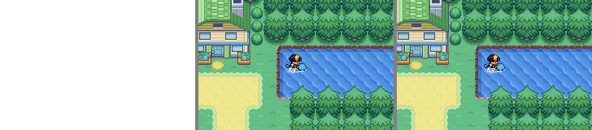
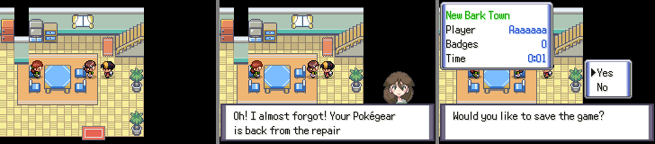

# POC da abordagem A — ROM de 92 MB no mapeamento linear

Feita em 26/09/2026 na branch `poc-rom-96mb-linear` (a partir de
`soulgold-rift-missions`, commit `29c919c2`), seguindo
[02-abordagem-a-linear.md](02-abordagem-a-linear.md).

## Veredito

**Viável, e funcionou.** Uma ROM de **92,14 MiB** boota, roda a intro, o
quarto, a cena da mãe, menus, Pokédex, menu de debug, save na Flash,
savestate, e surfa com o sprite próprio do Squirtle — **pixel a pixel
idêntica** à mesma ROM com 33 MB, e com áudio idêntico ao da ROM original.

Mas o doc 02 subestimou o custo: **"5 linhas no jogo" estava errado.** Havia
um achado novo, o mais grave de todos, que a auditoria não pegou e que
**quebra todo script do jogo**. Detalhe abaixo.

| | estimativa do doc 02 | POC real |
|---|---:|---:|
| Linhas no jogo | ~5 | **~35** (10 arquivos) + filler opcional |
| Linhas no emulador | ~40 | **~60** (4 arquivos) |
| Armadilhas de runtime | 5 | **8** (3 novas; 1 fatal em qualquer ROM > 32 MB) |
| Tempo de POC | — | 1 sessão |

## O que ganha

| | antes | depois |
|---|---:|---:|
| Teto de endereçamento | 32 MiB | **96 MiB** |
| Usado hoje (sem os toggles) | 29,70 MiB | 29,70 MiB |
| Livre | **2,30 MiB** | **66,3 MiB** (~29×) |
| Tamanho do `.gba` | 32,00 MiB (padding do `gbafix -p`) | **igual ao conteúdo** (29,70 MiB hoje) |

Com o teto novo foi possível ligar de verdade os toggles que não cabiam:

| toggle | efeito | ROM |
|---|---|---:|
| (nenhum) | | 29,70 MiB |
| `OW_SURF_UNIQUE_SPRITES` + `OW_BATTLE_ONLY_FORMS` (megas no overworld) | +2,28 MiB | 31,98 MiB — ainda cabia, por 23 KB |
| + `P_MODIFIED_MEGA_CRIES` | +1,16 MiB | **33,14 MiB — passa de 32** |

Os três estão **ligados nesta branch** (`include/config/overworld.h`,
`include/config/pokemon.h`). A ROM padrão da branch já tem 33,14 MiB e **só
roda no mGBA patchado**.

## O que custa (o preço real)

O custo de código é pequeno. O custo de verdade é de distribuição:

1. **A ROM deixa de rodar em qualquer outro lugar.** Testado: o mGBA 0.11
   sem patch mostra **tela branca** com a ROM de 33 MB — basta 1 MB acima do
   limite. O `crt0` copia os dados iniciais de IWRAM/EWRAM do fim da ROM, que
   passou de 32 MB, então o jogo morre antes do copyright. Nada de VBA,
   mGBA oficial, RetroArch, celular, flashcart ou hardware real. O jogador
   **precisa** do executável próprio.
2. **Fork permanente do mGBA**, em `memory.c` (o arquivo mais mexido do
   core). Cada atualização do upstream = rebase com conflito.
3. **Build do emulador para 3 plataformas** (e o `mgba-rom-test` também —
   ver "Testes" abaixo).
4. **RAM do emulador:** 67 MB → 132 MB (buffer de ROM de 128 MB). Irrelevante
   em PC.
5. **Desempenho:** ~1.950 fps nos três casos no runner headless (≈32× tempo
   real). +2% com 33 MB, +7% com 92 MB. Irrelevante.

## Dificuldade

**Baixa em código, média no total.** Tudo que precisou mudar foi achado
rodando o jogo, não lendo código — e os dois bugs mais graves (6 e 7) só
apareceram assim. Nenhum deu erro de build.

## Os achados — 5 previstos + 3 novos

| # | Achado | Previsto? | Sintoma se esquecer | Correção |
|---|---|---|---|---|
| 1 | `ROM_END` = 0x0A000000 (`field_name_box.c`) | sim | plaquinha de falante some | `ROM_END` = 0x0E000000 |
| 2 | `malloc` guarda ponteiro em 25 bits | sim | `MemBlockLocation` mente | `locationHi` 11 → 15 bits (usa `unused_00`) |
| 3 | `make syms` filtra `^0[2389]` | sim | 0 símbolos em 0x0A–0x0D | `^0[2389a-d]` |
| 4 | `gbafix -p` | sim | ROM de 33 MB vira 64 MB | tirar o `-p` |
| 5 | `mgba-rom-test` pré-compilado | sim | testes rodam em ROM truncada | recompilar (ver "Testes") |
| **6** | **Script usa o espelho 0x0A000000 como marca** | **não** | **todo script do jogo trava** | marca no bit 28 (abaixo) |
| **7** | **WS2 sem configurar em `main.c`** | não | dados em 0x0C–0x0D lidos com waitstate lento | `WAITCNT_WS2_S_1 \| WAITCNT_WS2_N_3` |
| 8 | `_pristineCow` do mGBA copia a ROM num buffer de 32 MB | não (emulador) | *buffer overflow* no emulador ao ligar o RTC | buffer do tamanho certo |

### 6 — o espelho 0x0A000000 era usado de propósito

O pokeemerald-expansion marca comandos de script, specials e
`callnative`/`gotonative` "instrumentados" (`requests_effects=1`, usados pelo
`RunScriptImmediatelyUntilEffect`) **somando 32 MB ao ponteiro da função**:

```asm
.4byte \value + ROM_SIZE     @ data/script_cmd_table.inc, specials.inc, asm/macros/event.inc
```

e testando `(ptr & 0xE000000) == 0xA000000`. A função é **chamada pelo
espelho**: `(*func)(ctx)` salta para 0x0Axxxxxx, que no GBA espelha
0x08xxxxxx. Quase todos os comandos de script (`end`, `call`, `goto`,
`setflag`...) são marcados.

Com o mapeamento linear não existe espelho: 0x0A000000 é dado de verdade.
Resultado medido: a intro (que é C) roda, e **no primeiro script** o CPU salta
para `0x04000130` (registrador de I/O) — 9,2 milhões de acessos inválidos e
o jogo congelado em "I'll see you later!". Isso acontece em **qualquer** ROM
acima de 32 MB, não só na de 92.

A varredura do doc 02 procurou `0x08000000`, `0x01FFFFFF` e `0x09FFFFFF` —
mas a constante aqui é `0xA000000`/`ROM_SIZE`, e o risco 1 do doc ("espelhos
deixam de existir… a varredura não achou nada") era exatamente este.

**Correção:** a marca passou a ser o bit 28 (`SCRIPT_EFFECT_TAG =
0x10000000`, em `constants/gba_constants.inc` e `include/script.h`), que
nunca é endereço válido, e é removida com `Script_UntagFunc()` nos 6 pontos
de chamada (`script.c` ×3, `scrcmd.c` ×3). Se alguém esquecer de remover, o
salto para 0x1xxxxxxx trava na hora em vez de executar dado em silêncio.
Funciona igual em ROM ≤ 32 MB.

## O que mudou

### Jogo (~35 linhas úteis)

| arquivo | mudança |
|---|---|
| `ld_script_modern.ld` | `LENGTH = 96M`; seção `rom_filler` (só POC) |
| `include/gba/defines.h` | `ROM_END` 0x0E000000 |
| `include/malloc.h` | `locationHi:15` |
| `Makefile` | sem `gbafix -p`; `syms` com `^0[2389a-d]`; regra do `ROM_FILLER_MB` |
| `src/main.c` | WS2 rápido |
| `constants/gba_constants.inc`, `include/script.h`, `src/script.c`, `src/scrcmd.c`, `asm/macros/event.inc`, `data/script_cmd_table.inc`, `data/specials.inc` | marca de script no bit 28 |
| `include/config/overworld.h`, `include/config/pokemon.h` | os 3 toggles (teste com conteúdo real) |
| `data/rom_filler.s` | filler da POC (vazio por padrão) |

`make ROM_FILLER_MB=N` insere N MB de `0xFF` entre `script_data` e
`.rodata`, empurrando **todo** o `.rodata` (som, gráficos, mapas, nomes de
falante) e os dados iniciais de RAM para cima. Com `ROM_FILLER_MB=59` a ROM
tem 92,14 MiB e, por exemplo:

| símbolo | endereço |
|---|---|
| `gSurfingOverlayPicTable_Squirtle` | 0x0C915E58 |
| `gObjectEventPic_Squirtle` | 0x0C8B075C |
| `gMonFrontPic_Squirtle` | 0x0C8B0EF8 |
| `mus_dp_route216_day_5` | 0x0DB000F3 |
| `__rom_end` | 0x0DC24F8C |

### Emulador (`tools/mgba-master`, ~60 linhas)

- `memory.h`: `GBA_SIZE_ROM_LINEAR` (96 MiB), buffer de 128 MiB e campo
  `romAddrMask` por cartucho.
- `memory.c`: as 25 máscaras `address & (GBA_SIZE_ROM0 - N)` viram
  `memory->romAddrMask`; `_pristineCow` usa o tamanho do buffer.
- `gba.c`: `GBALoadROM` aceita arquivo de 32–96 MiB: lê num buffer anônimo
  de 128 MiB preenchido com `0xFF` e liga `romAddrMask = 0x07FFFFFF`.
  **ROMs ≤ 32 MiB continuam com espelho** — o patch não muda nada para
  outros jogos.
- `serialize.c`: checagem do PC do savestate com a máscara certa.

## Como foi validado

Runner headless em cima do libmgba (`tools/rom_linear_poc/romrun.c`) que
segue um roteiro de teclas e registra screenshots, RMS do áudio por janela,
save da Flash, savestate e todo log de acesso fora da ROM.

```bash
tools/rom_linear_poc/build.sh                        # mGBA patchado + romrun
make -j$(nproc) ROM_FILLER_MB=59                     # 92 MB
build/rom_linear_poc/romrun Soulgold.gba /tmp/out tools/rom_linear_poc/surf_squirtle.txt
```

| teste | resultado |
|---|---|
| Intro → título → fala do Oak (`boot_intro.txt`), ROM original × 92 MB | 7/7 screenshots **idênticos** |
| Áudio por janela (intro, título, fala) | RMS **idêntico** à ROM original (antes do fix de WS2: diferença de 0,3%) |
| Quarto → escada → 1º andar → cena da mãe (emote, `applymovement`, mugshot) | 8/8 **idênticos** à ROM original |
| Menu → Save na Flash (0x0E000000) | 60.752 bytes gravados |
| Savestate: salva, anda, carrega, anda igual | replay **idêntico** |
| Menu debug: Squirtle, Cheat start, HM Surf, sair, surfar no lago de New Bark (`surf_squirtle.txt`), 33 MB × 92 MB | 26/26 **idênticos**; sprite de surf do Squirtle ok |
| Acessos fora da ROM / saltos inválidos | **0** em todos os roteiros |
| mGBA **sem** patch, ROM de 33 MB ou 92 MB | tela branca |
| `make release USE_LTO_ON_RELEASE=1` (32,56 MiB) | compila e roda até a cena da mãe, 0 acessos inválidos (o passo de BPS falha só por falta do `clean.gba` local) |






### Testes (`make check`)

**Não deu para usar.** `make check` **já não compila na branch original**
(`test/vs_seeker.c` usa `TRAINER_SHELBY_1`/`TRAINER_TABITHA_MT_CHIMNEY`, que
o romhack removeu, e `test/battle/*_control.party` falham com
`-Werror=override-init`). Confirmado com `git stash -u` sobre a
`soulgold-rift-missions` pura. Não é efeito da POC, mas significa que o
achado 5 continua em aberto: quando os testes voltarem a compilar, o
`tools/mgba/mgba-rom-test` pré-compilado precisa ser trocado pelo
`mgba-headless` patchado (as opções `-S`/`-R` são as mesmas).

## O que falta para virar produção

> Auditoria independente da POC e correções aplicadas em 27/09/2026:
> [08-auditoria-poc.md](08-auditoria-poc.md).

1. Decidir a distribuição: executável próprio do mGBA patchado (Win/Mac/Linux).
   É isso ou não fazer — não há meio-termo.
2. Recompilar o `mgba-rom-test` com o patch (depois de consertar o `make check`).
   O `ld_script_test.ld` já foi levado a 96 MiB (ver doc 08): o ROM de teste
   passa a ter ~62 MiB por shard, porque o slot DACS do BIOS é fixo em
   0x09FFC000 e o `.rodata` vai depois dele.
3. Tirar o `rom_filler` do linker e do Makefile (ou manter como ferramenta
   de teste — com `ROM_FILLER_MB=0` ele não ocupa nada).
4. BPS: o `make bps` gera patch para uma ROM > 32 MB; o Flips cria e aplica
   sem problema, e o soft-patch dentro do mGBA patchado (`.bps` ao lado da
   ROM) também funciona depois da correção de `GBAApplyPatch` (doc 08).
5. Reencenar um trecho maior do jogo (batalha, troca de mapa por conexão,
   evento com plaquinha de falante por ponteiro) no runner. A POC cobriu
   ~12.000 frames do começo do jogo.
6. Decidir se os três toggles (`OW_SURF_UNIQUE_SPRITES`, `OW_BATTLE_ONLY_FORMS`,
   `P_MODIFIED_MEGA_CRIES`) ficam ligados: enquanto estiverem, a ROM padrão da
   branch só roda no mGBA patchado.
